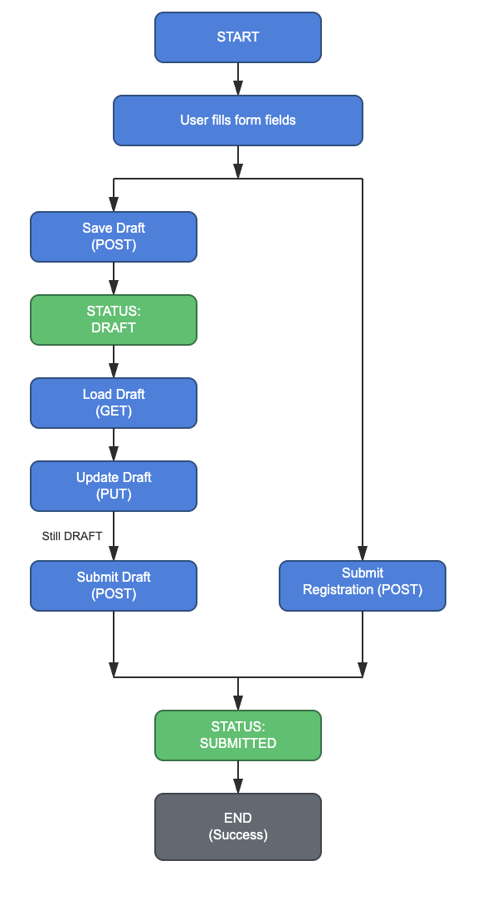

# Account Registration System

## Overview
Backend APIs for customer account registration with:
- **Name field (mandatory)**
- **Date of Birth field (mandatory, DD-MM-YYYY format)**
- **Valid NL Address (mandatory):**
  - Street name
  - House number (format: e.g., 123, 45A, 7-1, 123-bis)
  - Post code (4 digits + space + 2 letters, e.g., 1234 AB)
  - City
- **ID Document upload (mandatory for registration, optional for draft)**
- **Account Type (mandatory for registration, optional for draft)**
- **Starting Balance (optional field, must be >= 0)**
- **Email (optional field, must be valid email format)**
- **Monthly Salary (optional field, must be >= 0)**
- **Interested in other products (optional field, Y/N - stored as Y or N in database)**
- Real-time per-field validation for frontend
- Pause/Resume functionality
- Request ID tracking
- Immediate confirmation on submit

## Registration Workflow


## Features
- **Register Account**: Full validation and immediate confirmation with request ID (Name, DOB, Address, Account Type, ID Document all mandatory; Starting Balance, Email, Monthly Salary, Interested in Other Products optional)
- **Save as Draft**: Pause registration with minimal required fields (Name, DOB, Address mandatory; Account Type, ID Document, Starting Balance, Email, Monthly Salary, Interested in Other Products optional)
- **Update Draft**: Resume and update with full validation
- **Submit Draft**: Complete registration with full validation
- **Field Validation**: Real-time per-field validation for frontend feedback
- **Health Check**: Application health status endpoint

## Tech Stack
- Java 17 (Records for DTOs)
- Spring Boot 3.5.10
- Spring Data JPA
- MySQL 8
- Bean Validation (Jakarta)
- SpringDoc OpenAPI

## API Endpoints

### Health Endpoint
| Method | Endpoint | Description |
|--------|----------|-------------|
| GET | `/api/v1/health` | Health check - returns application status |

### Account Endpoints
| Method | Endpoint | Content-Type | Description |
|--------|----------|--------------|-------------|
| POST | `/api/v1/accounts/register` | `multipart/form-data` | Register new account OR submit existing draft (with optional requestId query param) |
| POST | `/api/v1/accounts/draft` | `multipart/form-data` | Save as draft (optional document) |
| PUT | `/api/v1/accounts/{requestId}` | `multipart/form-data` | Update draft with validation |
| GET | `/api/v1/accounts/{requestId}` | - | Get request by request ID |

### Validation Endpoints

Real-time field validation endpoints for frontend integration. All endpoints accept JSON request body.

| Method | Endpoint | Content-Type | Description |
|--------|----------|--------------|-------------|
| POST | `/api/v1/validation/name` | `application/json` | Validate name field |
| POST | `/api/v1/validation/dateOfBirth` | `application/json` | Validate date of birth (DD-MM-YYYY) |
| POST | `/api/v1/validation/streetName` | `application/json` | Validate street name field |
| POST | `/api/v1/validation/houseNumber` | `application/json` | Validate house number field |
| POST | `/api/v1/validation/postCode` | `application/json` | Validate post code field |
| POST | `/api/v1/validation/city` | `application/json` | Validate city field |


### Account Type Endpoints
| Method | Endpoint | Description |
|--------|----------|-------------|
| GET | `/api/v1/account-types` | Get all available account types |

## Requirements to run the application
- Java 17
- Maven 3.9+
- Docker & Docker Compose


## Run the app in Docker

```zsh
# Clean start (removes old data)
docker compose down -v
docker compose up --build
```


## API Documentation

Once running, access the Swagger UI at:
- http://localhost:8080/swagger-ui.html

OpenAPI spec available at:
- http://localhost:8080/openapi.yaml

## Example Requests

### Health Check
```bash
curl -X GET "http://localhost:8080/api/v1/health"
```

Response:
```json
{"status": "UP"}
```

### Register New Account
```bash
curl -X POST "http://localhost:8080/api/v1/accounts/register" \
  -H "Content-Type: multipart/form-data" \
  -F 'request={"name":"Priya","dateOfBirth":"15-05-1990","address":{"streetName":"Hoofdstraat","houseNumber":"123A","postCode":"1234 AB","city":"Amsterdam"},"accountType":"SAVINGS"};type=application/json' \
  -F "idDocument=@/path/to/passport.jpg"
```

Response (HTTP 201 Created):
```json
{
    "requestId": "AB2K-0590",
    "name": "Priya",
    "status": "SUBMITTED",
    ...
}
```

### Save Draft
```bash
curl -X POST "http://localhost:8080/api/v1/accounts/draft" \
  -H "Content-Type: multipart/form-data" \
  -F 'request={"name":"Priya","dateOfBirth":"15-05-1990","address":{"streetName":"Hoofdstraat","houseNumber":"123A","postCode":"1234 AB","city":"Amsterdam"}};type=application/json' \
  -F "idDocument=@/path/to/passport.jpg"
```

Response (HTTP 201 Created):
```json
{
    "requestId": "AB2K-0590",
    "name": "Priya",
    "status": "DRAFT",
    ...
}
```

### Submit Draft (Using Register Endpoint with requestId)
```bash
curl -X POST "http://localhost:8080/api/v1/accounts/register?requestId=AB2K-0590" \
  -H "Content-Type: multipart/form-data" \
  -F 'request={"name":"Priya","dateOfBirth":"15-05-1990","address":{"streetName":"Hoofdstraat","houseNumber":"123A","postCode":"1234 AB","city":"Amsterdam"},"accountType":"SAVINGS"};type=application/json'
```

**Note:** ID document is optional when submitting a draft if it was already uploaded during draft creation.

Response (HTTP 200 OK):
```json
{
    "requestId": "AB2K-0590",
    "name": "Priya",
    "status": "SUBMITTED",
    ...
}
```

### Update Draft
```bash
curl -X PUT "http://localhost:8080/api/v1/accounts/AB2K-0590" \
  -H "Content-Type: multipart/form-data" \
  -F 'request={"name":"Priya Updated","dateOfBirth":"15-05-1990","address":{"streetName":"Hoofdstraat","houseNumber":"123A","postCode":"1234 AB","city":"Amsterdam"},"accountType":"CURRENT"};type=application/json' \
  -F "idDocument=@/path/to/new_passport.jpg"
```

Response (HTTP 200 OK):
```json
{
    "requestId": "AB2K-0590",
    "name": "Priya Updated",
    "accountType": "CURRENT",
    "status": "DRAFT",
    ...
}
```

### Validate Field Examples (JSON body)

**Validate Name:**
```bash
curl -X POST "http://localhost:8080/api/v1/validation/name" \
  -H "Content-Type: application/json" \
  -d '{"fieldName":"name","fieldValue":"Priya"}'
```

**Response (Valid):**
```json
{
  "valid": true,
  "message": "Valid"
}
```

**Validate Date of Birth:**
```bash
curl -X POST "http://localhost:8080/api/v1/validation/dateOfBirth" \
  -H "Content-Type: application/json" \
  -d '{"fieldName":"dateOfBirth","fieldValue":"15-05-1990"}'
```

**Validate Post Code:**
```bash
curl -X POST "http://localhost:8080/api/v1/validation/postCode" \
  -H "Content-Type: application/json" \
  -d '{"fieldName":"postCode","fieldValue":"1234 AB"}'
```

### Get Account by Request ID
```bash
curl -X GET "http://localhost:8080/api/v1/accounts/AB2K-0590"
```

## Example Response

```json
{
    "requestId": "AB2K-0590",
    "name": "Priya",
    "dateOfBirth": "15-05-1990",
    "idDocument": {
        "documentName": "passport.jpg",
        "documentType": "image/jpeg",
        "documentSize": 102400
    },
    "address": {
        "streetName": "Hoofdstraat",
        "houseNumber": "123A",
        "postCode": "1234 AB",
        "city": "Amsterdam"
    },
    "accountType": "SAVINGS",
    "startingBalance": 5000.00,
    "status": "SUBMITTED"
}
```

## Account Types

The system supports three account types:
- **SAVINGS** - Best for accumulating savings with competitive interest rates
- **CURRENT** - Ideal for daily business and personal transactions
- **INVESTMENT** - Perfect for investment and wealth management

Account type is **mandatory** for account registration but **optional** for draft creation.


## Complete Example Request with All Optional Fields

```bash
curl -X POST "http://localhost:8080/api/v1/accounts/register" \
  -H "Content-Type: multipart/form-data" \
  -F 'request={"name":"Priya","dateOfBirth":"15-05-1990","address":{"streetName":"Hoofdstraat","houseNumber":"123A","postCode":"1234 AB","city":"Amsterdam"},"accountType":"SAVINGS","startingBalance":5000.00,"email":"priya@example.com","monthlySalary":7500.00,"interestedInOtherProducts":"Y"};type=application/json' \
  -F "idDocument=@/path/to/passport.jpg"
```
## Complete Example Response with All Fields

```json
{
    "requestId": "AB2K-0590",
    "name": "Priya",
    "dateOfBirth": "15-05-1990",
    "idDocument": {
        "documentName": "passport.jpg",
        "documentType": "image/jpeg",
        "documentSize": 102400
    },
    "address": {
        "streetName": "Hoofdstraat",
        "houseNumber": "123A",
        "postCode": "1234 AB",
        "city": "Amsterdam"
    },
    "accountType": "SAVINGS",
    "startingBalance": 5000.00,
    "email": "priya@example.com",
    "monthlySalary": 7500.00,
    "interestedInOtherProducts": "Y",
    "status": "SUBMITTED"
}
```
